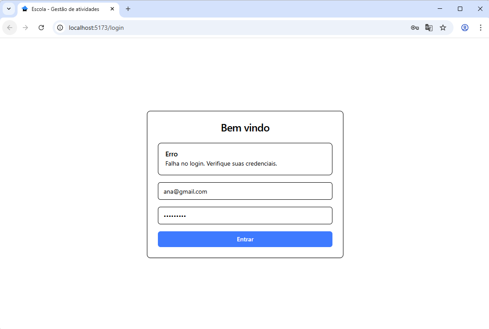
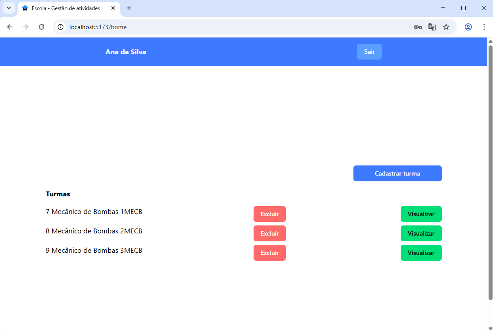
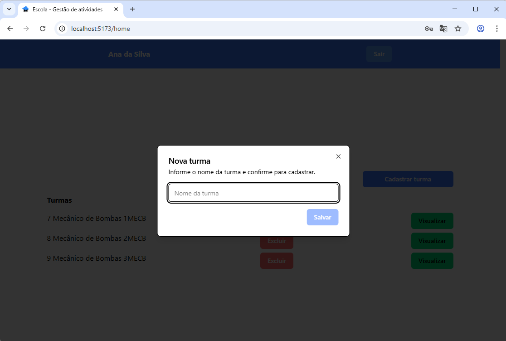
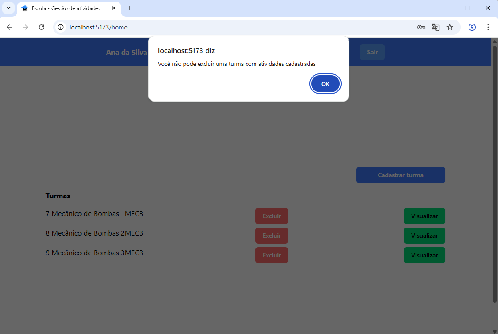
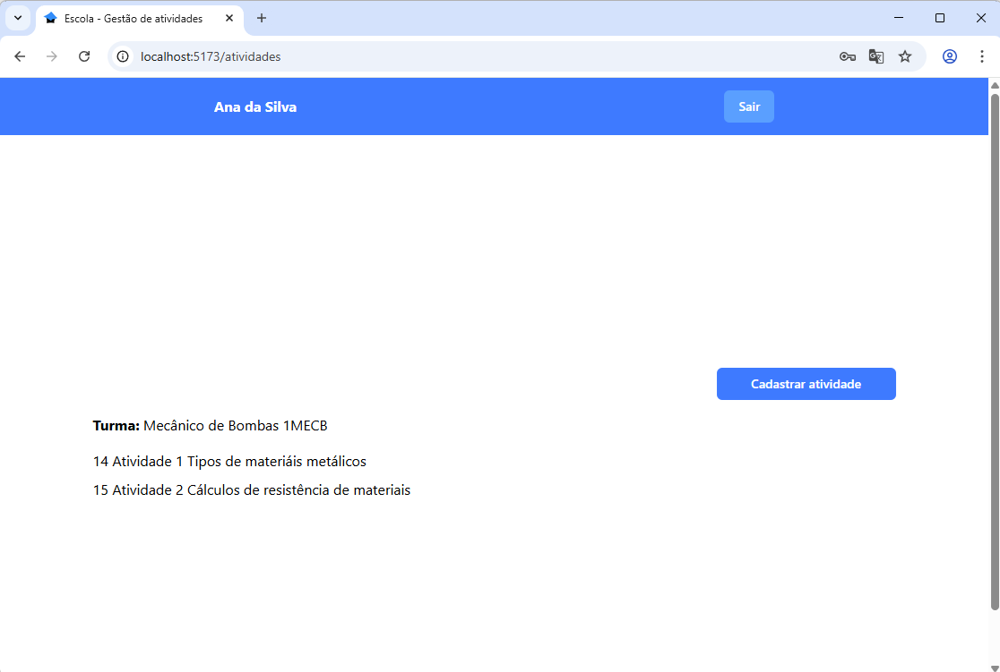
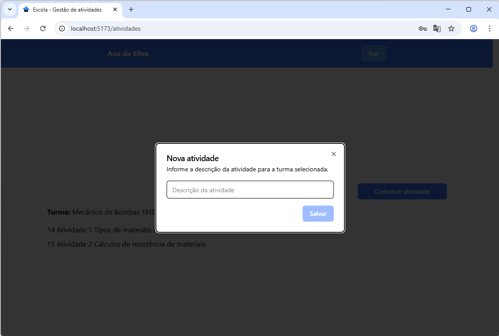

# Escola
## Gestão web de atividades por professor

## Ambiente de desenvolvimento
- Node.js
- MySQL (XAMPP- MariaDB)
- Prisma ORM
- React.js
- Vite

## Passo a passo para executar o projeto localmente

1. Clone o repositório
2. Configure o banco de dados MySQL
3. Acesse a pasta web e instale as dependências
```bash
cd api
npm install
```
4. Adicione o arquivo `.env` na raiz do projeto com a seguinte configuração:
- Certifique-se de que o MySQL está em execução (usando XAMPP ou outro gerenciador)

```js
DATABASE_URL="mysql://root@localhost:3306/escola"
```
5. Execute as migrações do Prisma para configurar o banco de dados
```bash
npx prisma migrate dev --name init
```
6. Inicie o servidor de desenvolvimento
```bash
npm run dev
```

7. acesse a pasta do front end `./web` instale as dependências e inicie o servidor de desenvolvimento
```bash
cd web
npm install
npm run dev
```
Clicar no link localhost para executar, semelhante a este http://localhost:5173/

## Screenshots







